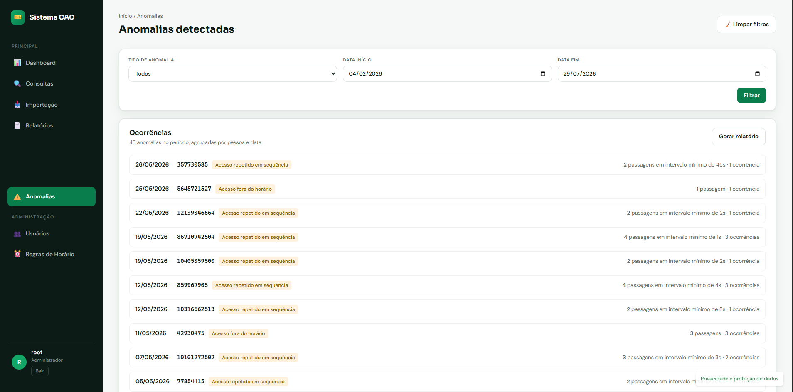
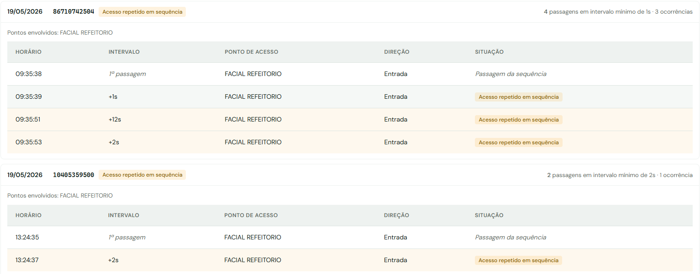
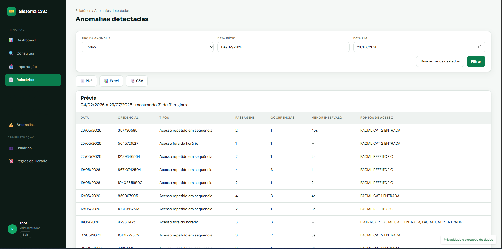
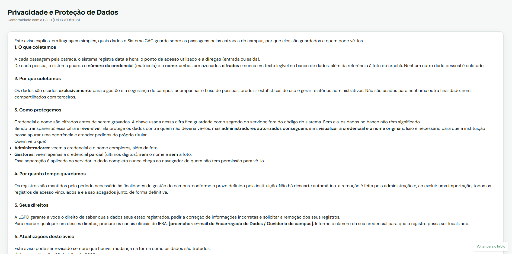
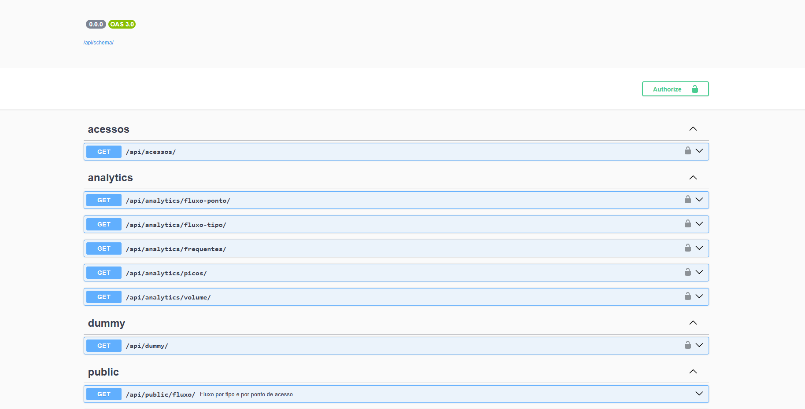

# Sistema CAC — Controle de Acesso do Campus
[](https://github.com/ricardo-rals/controle_catraca/actions/workflows/ci.yml) 


## 📌 Descrição

O Sistema CAC — Controle de Acesso do Campus é uma aplicação desenvolvida para analisar os dados das catracas eletrônicas do IFBA. Ele permite acompanhar acessos em tempo real, gerar relatórios personalizados e consultar estatísticas de uso, oferecendo uma visão clara e organizada da movimentação no campus.

## ✨ Funcionalidades

- **Importação de CSV/XLSX** com validação, deduplicação e relatório de linhas rejeitadas.
- **Consultas** dos registros de acesso com filtros combináveis por credencial, período, ponto de acesso e direção.
- **Dashboard** com KPIs do período, volume ao longo do tempo e horários de maior fluxo.
- **Relatórios** exportáveis em PDF, Excel e CSV.
- **Detecção automática de anomalias** — volume atípico do dia, acesso fora do horário e acesso repetido em sequência.
- **API pública** com dados agregados, autenticada por chave e documentada em Swagger.
- **Proteção de dados por perfil** — credencial e nome ficam cifrados no banco; o administrador vê o dado completo, o gestor vê a credencial mascarada.

### 🔎 Detecção de anomalias

O sistema sinaliza três tipos de ocorrência fora do padrão:

| Tipo | O que detecta |
|------|---------------|
| Volume atípico | Dia cujo total de acessos foge da média móvel de 30 dias em mais de 2 desvios padrão |
| Acesso fora do horário | Passagem fora das faixas cadastradas em Regras de Horário |
| Acesso repetido em sequência | Mesma credencial no mesmo equipamento dentro de uma janela curta (padrão: 60s) |

A detecção roda ao final de cada importação bem-sucedida e também pelo comando:

```bash
./dev.sh exec python manage.py detectar_anomalias
```

A janela e o escopo da repetição são calibráveis por `ANOMALIA_JANELA_SEGUNDOS` e `ANOMALIA_ESCOPO` — equipamentos variam entre instalações, e o valor certo depende de como o campus montou as catracas.

O **detalhamento das anomalias é restrito ao perfil Administrador**, porque identifica pessoas. Outros perfis veem quantas ocorrências existem e são orientados a comunicar o administrador.

### 🌐 API pública

Endpoints agregados sob `/api/public/`, autenticados por chave no header `X-API-Key` (gerada no Django Admin, armazenada apenas como hash):

| Endpoint | Retorna |
|----------|---------|
| `/api/public/volume/` | Total de acessos por dia, semana ou mês |
| `/api/public/picos/` | Distribuição por hora do dia e dias de maior volume |
| `/api/public/fluxo/` | Composição entre entradas e saídas e total por catraca |

Documentação navegável em `/api/public/docs/`, aberta e sem login. Nenhuma resposta pública contém dado por pessoa.

## 🎬 Vídeo de demonstração

_Em produção (HU-046) — o link será publicado aqui._

## 🖼️ Screenshots


### Login


Tela inicial de autenticação, onde o usuário informa suas credenciais para acessar o sistema.

### Dashboard


Visão geral do período selecionado: KPIs, volume de acessos ao longo do tempo, horários de maior fluxo e o resumo de anomalias detectadas.

### Consultas


Histórico completo dos eventos registrados pelas catracas, com filtros combináveis e exportação.

### Importações


Carga de arquivos CSV/XLSX, com o resultado do processamento e as linhas rejeitadas.

### Relatórios


Central de relatórios, com filtros por período e exportação em PDF, Excel e CSV.

### Usuários


Listagem dos usuários cadastrados, com opções de ativar, desativar ou editar.

### Novo usuário


Formulário de criação de usuário, incluindo dados pessoais e perfil de acesso.

### Regras de horário


Cadastro das faixas de funcionamento por grupo de equipamento e dia da semana, base da detecção de acesso fora de horário.

### Anomalias

<!-- print pendente: salvar como docs/Telas/anomalias.png -->


Anomalias detectadas, agrupadas por pessoa e data, com filtro por tipo e período.

### Detalhe de uma anomalia

<!-- print pendente: salvar como docs/Telas/anomalias_detalhe.png (bloco expandido) -->


Bloco expandido com a linha do tempo completa da sequência: horário de cada passagem, intervalo entre elas, ponto de acesso e qual passagem disparou o alerta.

### Relatório de anomalias

<!-- print pendente: salvar como docs/Telas/relatorio_anomalias.png -->


Relatório exclusivo do perfil Administrador, com a contagem de passagens e ocorrências por pessoa.

### Página de privacidade

<!-- print pendente: salvar como docs/Telas/privacidade.png -->


Aviso público de privacidade, acessível sem login, em linguagem de cidadão.

### API pública (Swagger)

<!-- print pendente: salvar como docs/Telas/api_publica.png (tela de /api/public/docs/) -->


Documentação navegável dos endpoints públicos, aberta e sem autenticação.

---

## 📚 Documentação

Toda a documentação detalhada está disponível na pasta [docs/](docs/).
Inclui guias de arquitetura, fluxo de dados e instruções avançadas de uso.

- [Instalação e execução](docs/instalacao.md)
- [Arquitetura](docs/arquitetura.md)
- [Decisões de arquitetura (ADRs)](docs/decisoes.md)
- [LGPD e privacidade](docs/lgpd.md)
- [Schema de validação de CSV (importação)](docs/schema.md)
- [Guia de desenvolvimento](docs/guia_de_desenvolvimento.md)
- [Protótipo de telas](docs/prototipo_telas_CAC.html)

## 🛠️ Stack

### Backend
- Python 3.12
- Django 5

### Banco de Dados
- PostgreSQL

### Relatórios
- Pandas
- OpenPyXL
- WeasyPrint

### Infraestrutura
- Docker
- Docker Compose

### Documentação
- Swagger (drf-spectacular)

### CI/CD
- GitHub Actions

## 🚀 Setup resumido


Para rodar o projeto em ambiente de desenvolvimento:

```bash
git clone https://github.com/ricardo-rals/controle_catraca.git
cd controle_catraca
cp .env.example .env
./dev.sh up
./dev.sh migrate
./dev.sh seed   # popula o banco com dados de exemplo
./dev.sh createsuperuser
```

Depois, acesse no navegador:

| Endereço | O que é |
|----------|---------|
| <http://localhost:8000> | Aplicação |
| <http://localhost:8000/admin> | Django Admin (perfil administrador) |
| <http://localhost:8000/anomalias/> | Anomalias detectadas |
| <http://localhost:8000/privacidade/> | Aviso de privacidade (público, sem login) |
| <http://localhost:8000/api/public/docs/> | Swagger da API pública (sem login) |
| <http://localhost:8000/api/schema/swagger-ui/> | Swagger da API interna |

### ⚙️ Variáveis de ambiente opcionais

Além das de `.env.example`, estas ajustam o comportamento sem mexer no código:

| Variável | Padrão | Para que serve |
|----------|--------|----------------|
| `ANOMALIA_JANELA_SEGUNDOS` | `60` | Intervalo abaixo do qual duas passagens da mesma credencial viram anomalia |
| `ANOMALIA_ESCOPO` | `equipamento` | O que conta como "mesmo lugar" na repetição: `equipamento` ou `grupo` |
| `API_PUBLICA_RATE` | `60/hour` | Limite de requisições por chave na API pública |
| `UPLOAD_MAX_BYTES` | `10485760` | Tamanho máximo do arquivo de importação |
