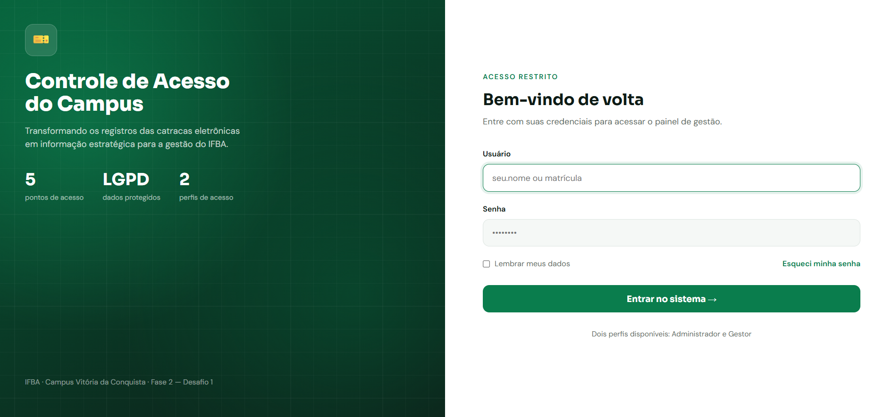
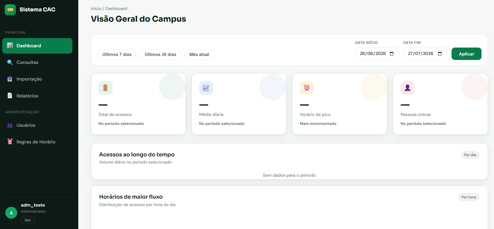
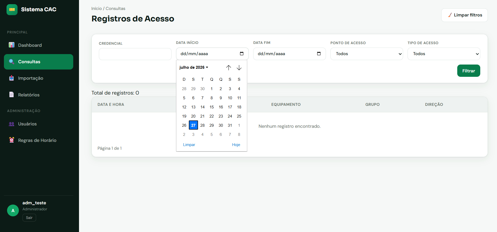
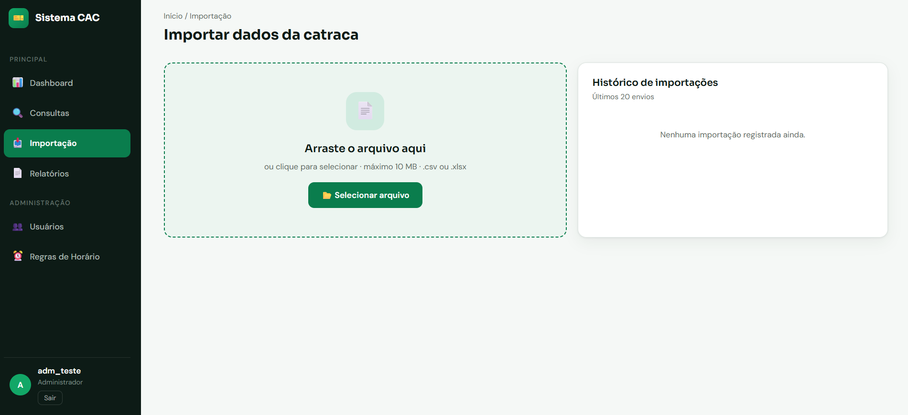
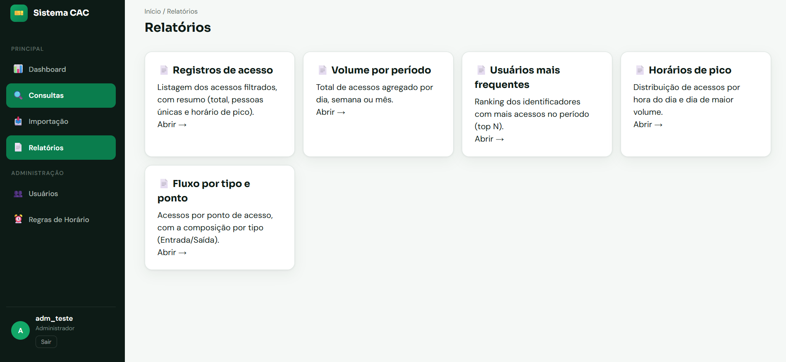
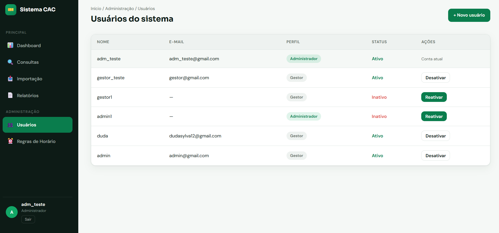
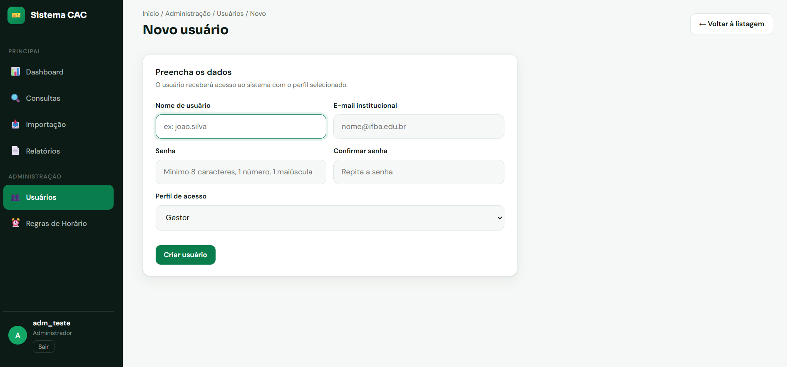
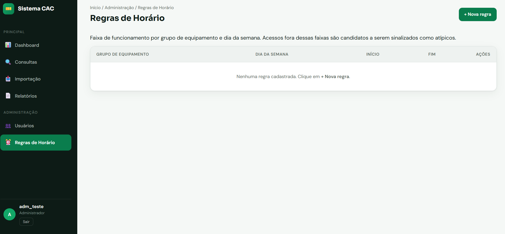

# Sistema CAC — Controle de Acesso do Campus
[](https://github.com/ricardo-rals/controle_catraca/actions/workflows/ci.yml) 


## 📌 Descrição

O Sistema CAC — Controle de Acesso do Campus é uma aplicação desenvolvida para analisar os dados das catracas eletrônicas do IFBA. Ele permite acompanhar acessos em tempo real, gerar relatórios personalizados e consultar estatísticas de uso, oferecendo uma visão clara e organizada da movimentação no campus.

## 🎬 Vídeo de demonstração

_Em produção (HU-046) — o link será publicado aqui._

## 🖼️ Screenshots

### Tela de login


Tela de login: Tela inicial de autenticação, onde o usuário informa suas credenciais para acessar o sistema.

### Dashboard


Dashboard: visão geral dos acessos e estatísticas principais.

### Tela de Consultas


Consultas: Histórico completo dos eventos de acesso registrados pelas catracas, com filtros e exportação.

### Tela de Importações


Tela de Importações: Interface para carregar arquivos externos (ex.: CSV) e integrar dados de acessos ao sistema.

### Tela de Relatorios


Tela de Relatorios: visão geral dos acessos e estatísticas principais.

### Tela de Usuários


Tela de Usuários: Listagem de todos os usuários cadastrados, com opções de ativar, desativar ou editar informações.

### Tela de Novo Usuário


Tela de Novo_Usuário: Formulário para criação de um novo usuário, incluindo dados pessoais e permissões de acesso.

### Tela de Regra de Horário


Tela de Horário: Consulta detalhada dos registros de entrada e saída, filtrados por período e usuário.

---

## 📚 Documentação

Toda a documentação detalhada está disponível na pasta [docs/](docs/).
Inclui guias de arquitetura, fluxo de dados e instruções avançadas de uso.

- [Instalação e execução](docs/instalacao.md)
- [Arquitetura](docs/arquitetura.md)
- [Decisões de arquitetura (ADRs)](docs/decisoes.md)
- [LGPD e privacidade](docs/lgpd.md)
- [Schema de validação de CSV (importação)](docs/schema.md)
- [Guia de desenvolvimento](docs/guia_de_desenvolvimento.md)
- [Protótipo de telas](docs/prototipo_telas_CAC.html)

## 🛠️ Stack

### Backend
- Python 3.12
- Django 5

### Banco de Dados
- PostgreSQL

### Relatórios
- Pandas
- OpenPyXL
- WeasyPrint

### Infraestrutura
- Docker
- Docker Compose

### Documentação
- Swagger (drf-spectacular)

### CI/CD
- GitHub Actions

## 🚀 Setup resumido


Para rodar o projeto em ambiente de desenvolvimento:

```bash
git clone https://github.com/ricardo-rals/controle_catraca.git
cd controle_catraca
cp .env.example .env
./dev.sh up
./dev.sh migrate
./dev.sh seed   # popula o banco com dados de exemplo
./dev.sh createsuperuser
```

Depois, acesse no navegador:

- Aplicação: <http://localhost:8000>
- Admin: <http://localhost:8000/admin>
- Privacidade (pública, sem login): <http://localhost:8000/privacidade/>
