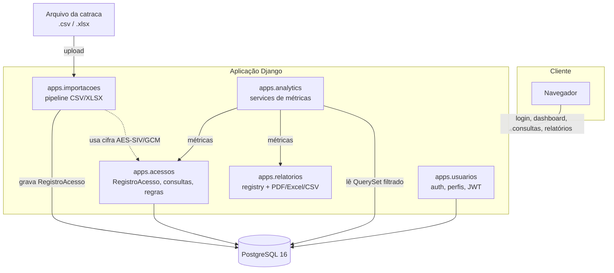
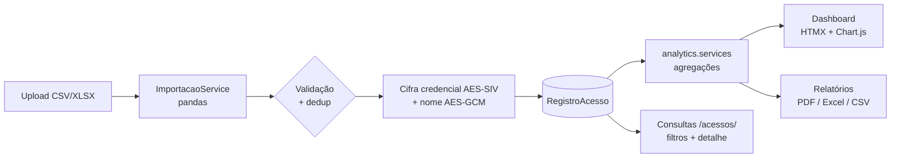

# Arquitetura — Sistema CAC (Controle de Acesso do Campus)

Aplicação Django que transforma os registros das catracas eletrônicas do IFBA em
informação de gestão. Roda inteiramente em contêineres Docker (Django + PostgreSQL).

## Visão de componentes

## Fluxo de dados (importação → visualização)

## Apps e responsabilidades

| App | Responsabilidade |
|-----|------------------|
| `apps/usuarios` | Modelo `UsuarioSistema` (AbstractUser + `perfil` admin/gestor), login, JWT, regra de visibilidade por perfil (`perfis.py`), seed de usuários. |
| `apps/importacoes` | Pipeline de importação (`ImportacaoService`, pandas): parsing, validação de cabeçalho/linha, deduplicação, cifra da credencial e do nome, persistência em lote. |
| `apps/acessos` | Modelos `RegistroAcesso`, `PontoAcesso`, `RegraHorario`; tela de consulta (`/acessos/`, filtros combináveis), detalhe, e CRUD de regras de horário (admin). |
| `apps/analytics` | Métricas como **funções puras** em `services.py` (recebem um QuerySet já filtrado, devolvem estrutura serializável) + endpoints REST. |
| `apps/relatorios` | Central de relatórios com um **registry** genérico; exporta em PDF (WeasyPrint), Excel (pandas+openpyxl) e CSV. |

## Camada de dados sensíveis (LGPD)

- A **credencial** é armazenada cifrada em `RegistroAcesso.credencial_cifrada` com
  **AES-SIV** (determinístico → permite deduplicar e cruzar acessos da mesma pessoa
  **e** ser descriptografada por quem tem o salt).
- O **nome** é armazenado cifrado em `nome_cifrado` com **AES-GCM**.
- A chave é derivada do segredo `PSEUDONIMIZACAO_SALT` (variável de ambiente).
- **Visibilidade por perfil** (`apps/usuarios/perfis.py`): o **admin** descriptografa e
  vê credencial + nome + foto; o **gestor** vê a credencial mascarada, sem nome nem foto.
- Detalhes e implicações em [`lgpd.md`](lgpd.md).

## Stack

- **Backend:** Django 5.0.6, Django REST Framework + SimpleJWT, django-filter.
- **Banco:** PostgreSQL 16 (contêiner `cac-db`, porta host `5433`).
- **Dados/relatórios:** pandas, openpyxl, WeasyPrint, cryptography (AES-SIV/GCM).
- **Front:** templates Django, HTMX (filtros do dashboard sem reload), Chart.js.
- **Infra local:** Docker Compose (`web` + `db`), atalhos em `Makefile`/`dev.sh`.
- **Qualidade:** ruff, black, pytest (+ pytest-django, cobertura). CI em `.github/workflows/ci.yml`.

## Ambientes

`config/settings/` é dividido: `base.py` (comum), `dev.py` (DEBUG, hosts locais) e
`prod.py`. O pytest usa `config.settings.dev`. Segredos vêm do `.env` (via
python-decouple) — ver [`instalacao.md`](instalacao.md).
